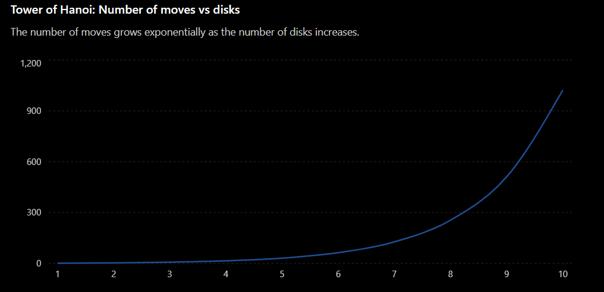

## Algorithm

1. Start the program.
2. Read the number of disks `n` from the user.
3. Call the function `TOH(n, 'A', 'B', 'C')`, where:
   - `A` = Source rod
   - `B` = Auxiliary rod
   - `C` = Destination rod
4. If `n == 1`:
   - Move the disk from the source rod to the destination rod.
   - Increment the move counter.
   - Return.
5. Otherwise:
   - Recursively move the top `n - 1` disks from the source rod to the auxiliary rod.
   - Move the largest disk from the source rod to the destination rod.
   - Increment the move counter.
   - Recursively move the `n - 1` disks from the auxiliary rod to the destination rod.
6. Repeat the above steps until all disks are moved.
7. Display the total number of moves.
8. End the program.

---

## Time Complexity

- **Recurrence Relation:**
  ```
  T(n) = 2T(n - 1) + 1
  ```

- **Time Complexity:**
  ```
  O(2^n)
  ```

  The algorithm makes two recursive calls for every disk (except the base case), resulting in an exponential number of operations.

- **Space Complexity:**
  ```
  O(n)
  ```

  The recursive function calls are stored in the call stack, whose maximum depth is equal to the number of disks (`n`).
  
  